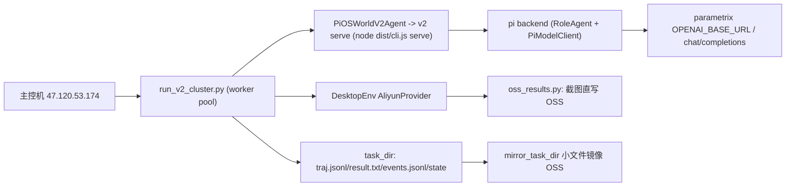

# pi-osworld-v2 集群实验计划

> 2026-08-11 重设计：以同事已跑通的集群仓库为基线，v2 只替换 agent 层，不复刻
> Aliyun / OSS / 断点续跑。参照仓库锁定：
> `moreC/OSWorld-V2` branch `dev/zhilongli`
> commit `e189bb845fcb9a1c7476a643c1729c06e4f66b24`（private repo）。

## 目标

- 在已有集群流程（主控机 `47.120.53.174`，Aliyun ECS + OSS + parametrix/qwen）上跑
  v2 harness 实验（m3 / stateact / 后续 mea、对比矩阵），不再依赖 MiniMax Token Plan。
- v2 的差异只体现在 `--config` YAML 与 prompts；runner 不因 harness 不同而改动。
- 复用同事仓库已验证的集群基建：AliyunProvider、oss_results、task_loader、
  lib_run_single、run_multienv 调度、镜像/TTL/SSH 纪律。

## 参照仓库基线与文件清单

| 文件 | 作用 | v2 是否复用 |
| --- | --- | --- |
| `desktop_env/providers/aliyun/` | ECS 生命周期：创建/删除/私网 IP/TTL/镜像 revert | 直接 import |
| `oss_results.py` | 截图直写 OSS + `mirror_task_dir` 小文件镜像 + 索引 | 直接 import |
| `task_loader.py` | v2 任务 JSON / task_class 解析 | 直接 import |
| `lib_run_single.py` | `run_single_example`：agent 循环、traj/result/checkpoint/multi-phase/memory tracer | 直接 import |
| `scripts/python/run_multienv.py` | PromptAgent 集群调度：worker queue、VM 复用/废弃、get_unfinished、args.json | 作为 `run_v2_cluster.py` 骨架 |
| `run_multienv_qwen_internal_agent.py` | QwenInternal XML tool-call runner（history_n / image folding） | 参考，v2 走 Pi provider 不直接复用 |
| `docs/OSWORLD_V2_ALIYUN_RUNBOOK.md` | 主控机操作手册、.env 字段、并发授权、红线 | 沿用 |
| `desktop_env/providers/aliyun/config.sh` | VM 镜像构建（noVNC / :5000 / wine / 国内源） | 沿用 |

关键事实（从 runbook 提取）：

- 主控机：`/home/zhilongli/OSWorld-V2`，venv `.venv/bin/python`，`.env` 已配好
  `ALIYUN_*` / `OSS_*` / `ANTHROPIC_*` / `OPENAI_BASE_URL` / `OPENAI_API_KEY`。
- qwen3.7-plus 走 OpenAI 协议：`POST {OPENAI_BASE_URL}/chat/completions`，模型名
  `qwen3.7-plus`，thinking-off（`enable_thinking: false`）。
- 官方 qwen 参数：screenshot + pyautogui + 500 steps + 16K max_tokens + 3s sleep。
- M3 走 MiniMax Anthropic 端点，与 v2 当前配置一致。
- 并发授权：1 env 联调、4 env（001-004）已授权；28/108 env 必须用户批准。
- TTL 180min 不动；镜像不覆盖；密钥不进 git。

## 核心决策

1. **不新写集群基建**：`python/run_v2_cluster.py` 以 `scripts/python/run_multienv.py`
   为骨架复制改造，只替换 agent 工厂为 `PiOSWorldV2Agent`，并增加 v2 参数
   （`--config` / `--config-root` / `--result-dir` / `--osworld-root` / `--task-set`）。
2. **OSWorld-V2 部署**：集群直接部署同事 fork（含 aliyun / oss / lib_run_single）。
   - 本地开发：clone `moreC/OSWorld-V2` 到 `external/OSWorld-V2-cluster`（锁 commit），
     不改官方 submodule，避免本地 docker 语义漂移。
   - 集群：锁同一 commit 于 `/home/zhilongli/OSWorld-V2`。
3. **结果布局**：沿用同事的
   `result_dir/<action_space>/<observation_type>/<model>/<domain>/<task_id>`；
   v2 的 `events.jsonl` / `state` / `runner.log` / `manifest.json` 放进 task_id 目录，
   这样 `get_unfinished` 与官方结果聚合脚本直接可用。
4. **模型协议**：qwen 走 parametrix OpenAI chat/completions。v2 需要在
   `src/models/client.ts` 注册一个自定义 provider（id 建议 `qwen-gateway`）：
   `baseUrl = OPENAI_BASE_URL`、`auth = envApiKeyAuth(..., ["OPENAI_API_KEY"])`、
   `api = openAICompletionsApi()`、模型 `qwen3.7-plus`（thinkingFormat=qwen）。
   YAML 里 `models.main: qwen-gateway/qwen3.7-plus`；MiniMax anthropic 路径共存。
5. **delegate / 子 agent**：集群 worker 进程内由 v2 serve 统一管理（Pi 后端），
   不经过同事的 QwenInternalAgent 解析器。

## 数据流



每个 OSWorld step 的调用链：

1. worker 从 task queue 取 task，创建/复用 VM（AliyunProvider）。
2. `lib_run_single.run_single_example` 调 `PiOSWorldV2Agent.predict(instruction, obs)`。
3. v2 serve 执行一轮 harness（含角色内部工具循环 / delegate / gate），返回 actions。
4. `env.step(action)` 执行 pyautogui；截图与轨迹写 task_dir（OSS_ENABLED 时截图直写 OSS）。
5. 任务结束 `env.evaluate()`，写 `result.txt` / `result.json`；`mirror_task_dir` 镜像小文件。

## 阶段计划

### Phase 0：前置依赖

- [ ] 本地锁版拉取：`external/OSWorld-V2-cluster` = `moreC/OSWorld-V2` @ dev/zhilongli。
- [ ] 确认 parametrix 网关可用域名（runbook 中 `omni-gateway-sg.parametrix.cn` 当前
      NXDOMAIN；用 `parametrix.cn/v1` 或让网关方确认稳定域名）。
- [ ] v2 增加 `qwen-gateway` provider + 单测（模型解析、thinking disabled、base_url/key）。
- [ ] `run_v2.py` / `run_v2_cluster.py` CLI 补 `--provider-name aliyun`、
      `--use-public-ip`、`--enable-vnc` / `--enable-recording`、`--region` 透传；
      `DesktopEnv` 构造与同事 runner 对齐（`use_public_ip` / `enable_proxy` /
      `require_a11y_tree` / `client_password`）。
- [ ] 本机 dry-run：用 mock 或 docker 验证 `run_v2_cluster.py` 参数与 worker 循环。

验收：`npm test` 通过；`run_v2_cluster.py --help` 包含全部集群参数；qwen provider
在本地以 parametrix key 发一次最小请求成功。

### Phase 1：集群单任务冒烟

- [ ] 部署 v2 `dist/` + `python/` + 配置树到主控机（`scripts/deploy-cluster.sh`）。
- [ ] `run_v2_cluster.py --config presets/stateact.yaml --provider-name aliyun
      --osworld-root /home/zhilongli/OSWorld-V2 --num-envs 1` 跑 task 001 / 004。
- [ ] 同时跑一个 m3 preset 作为对照；score 与本地 docker 同配置量级一致。
- [ ] 产物检查：`result.txt` / `result.json` / `traj.jsonl` / `events.jsonl` / `state` /
      `runner.log` / `args.json`；OSS 上有截图与镜像文件。

### Phase 2：并行 + 断点 + OSS

- [ ] worker 循环 + VM 复用 + `_discard_env` 失败废弃（沿用同事 runner 的做法）。
- [ ] `get_unfinished` 跳过已有 `result.txt`（断点续跑）。
- [ ] `mirror_task_dir` 每任务结束镜像；`args.json` 存档；worker 死亡自动重启。
- [ ] `--num-envs 4` 跑 `meta_001_004.json` 冒烟，与同事 qwen 流程对拍。

### Phase 3：矩阵实验

- [ ] 复用 v2 `matrix` / `compare`：2 配置 x 2 任务集，每个组合独立 run_id。
- [ ] 聚合 score / success rate + events 指标（delegate 次数、工具调用、gate verdict）。
- [ ] 输出 markdown 对比报告；与 v1 / 官方 baseline 做同配置对比。

### Phase 4：生产化

- [ ] `scripts/deploy-cluster.sh`：rsync pi-osworld-v2（dist + python + 配置树），
      锁 OSWorld-V2 commit，写 `.env` 校验。
- [ ] `scripts/cluster/start-*.sh` / `monitor.sh`：setsid nohup、pgrep、日志、OSS prefix。
- [ ] 运行手册：并发授权流程、TTL、镜像版本、故障排查速查表。

## 结果目录约定

```text
<result_dir>/
└── pyautogui/screenshot/<model>/<domain>/<task_id>/
    ├── result.txt / result.json
    ├── traj.jsonl
    ├── events.jsonl            # v2 结构化事件
    ├── state/                  # v2 TaskStateStore
    ├── runner.log
    ├── args.json               # 集群 runner 参数存档
    ├── step_*.png              # OSS_ENABLED=1 时直写 OSS，本地可能只有索引
    └── recording.mp4
```

`get_unfinished` 以 `result.txt` 为准，因此同一结果目录重跑不会重复执行已完成任务。

## 部署与环境变量

主控机 `.env`（已存在，v2 部署时复用，不新造）：

```bash
ALIYUN_ACCESS_KEY_ID / ALIYUN_ACCESS_KEY_SECRET
ALIYUN_REGION / ALIYUN_IMAGE_ID / ALIYUN_INSTANCE_TYPE
ALIYUN_VSWITCH_ID / ALIYUN_SECURITY_GROUP_ID
DEFAULT_TTL_MINUTES=180 / ENABLE_TTL=true
OSS_ENABLED=1 / OSS_ACCESS_KEY_ID / OSS_ACCESS_KEY_SECRET
OSS_BUCKET / OSS_ENDPOINT / OSS_PREFIX
ANTHROPIC_BASE_URL=https://api.minimaxi.com/anthropic
ANTHROPIC_API_KEY / ANTHROPIC_MODEL=m3
OPENAI_BASE_URL=<parametrix>/v1
OPENAI_API_KEY
```

v2 部署目录建议：`/home/zhilongli/pi-osworld-v2`（或新用户名目录），`--osworld-root`
指向 `/home/zhilongli/OSWorld-V2`（同事 fork）。

## 风险与决策点

1. **网关稳定性/域名**：`omni-gateway-sg.parametrix.cn` 当前 NXDOMAIN；先用
   `parametrix.cn/v1`，后续让网关方提供稳定域名，或把 base URL 做成 YAML/env 可覆盖。
2. **OSWorld-V2 版本漂移**：同事 fork 会继续改；集群和本地都锁 dev/zhilongli commit，
   升级需单独 diff review。
3. **并发与配额**：28 env 起 ECS 可能撞配额；28 个 agent 共用同一 api key 有 429 风险。
   v2 的 `llm_retry` spec 要在集群运行中开启。
4. **结果布局**：默认沿用官方/同事布局，避免 `get_unfinished` 和 score 聚合失效；
   如果要 v2 特有布局，需要同步改 `get_unfinished` 与聚合脚本。
5. **协议差异**：同事 QwenInternalAgent 用 XML tool-call + history folding，v2 用 Pi
   的 native tool call + 上下文管理器；集群对比实验必须用同一 harness 语义（v2），
   与官方 baseline 对比时才需要协议对齐。
6. **SSH/密钥**：`docs/OSWORLD_V2_ALIYUN_RUNBOOK.md` 与 `.env` 禁止 push 到公开仓库。
