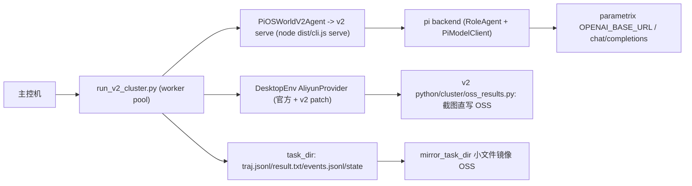

# pi-osworld-v2 集群实验计划

> 2026-08-11 重设计（v2 自包含版）：**不依赖同事仓库**。
> `moreC/OSWorld-V2` `dev/zhilongli` 只作为行为参考，不进入 clone / submodule / 部署。
> 集群所需的 Aliyun / OSS / 调度增强全部由 pi-osworld-v2 自己维护，运行时只依赖
> 官方 OSWorld-V2 submodule + v2 自身代码。

## 目标

- 在已有集群流程（主控机 `47.120.53.174`，Aliyun ECS + OSS + parametrix/qwen）上跑
  v2 harness 实验（m3 / stateact / 后续 mea、对比矩阵），不再依赖 MiniMax Token Plan。
- v2 的差异只体现在 `--config` YAML 与 prompts；runner 不因 harness 不同而改动。
- 集群能力以 v2 自有模块 / 补丁维护，避免把实验框架绑定到任何个人 fork。

## 集群能力清单与归属

先核对官方 OSWorld-V2 submodule 现状，只补缺失部分：

| 能力 | 官方 OSWorld-V2 现状 | v2 方案 |
| --- | --- | --- |
| Aliyun ECS provider（创建/删除/私网 IP/TTL） | 已有 `desktop_env/providers/aliyun/` | 直接用；稳定性修复走 `patches/osworld-cluster.patch` |
| `task_loader.py`（v2 任务解析） | 已有，与参考实现一致 | 直接用 |
| `lib_run_single.py`（agent 循环 / checkpoint / multi-phase） | 已有 | 直接用；OSS 截图写入走 v2 补丁 |
| OSS 截图直写 + 小文件镜像 | 官方无 `oss_results.py` | v2 自持 `python/cluster/oss_results.py` |
| 集群 worker 调度（VM 复用/废弃、断点续跑、args.json） | 官方 `run_multienv.py` 是参考 | v2 自持 `python/run_v2_cluster.py` |
| VM 镜像构建脚本 | 官方无 | v2 自持 `scripts/cluster/build-aliyun-image.sh`（可选，按需移植） |
| Aliyun / OSS Python SDK | 未在 v2 依赖里 | `python/cluster/requirements-cluster.txt` |

## 核心决策

1. **唯一运行时依赖**：官方 OSWorld-V2 submodule（已 pin）+ v2 自身代码。
   同事 fork 只用于对照行为，不加入 `.gitmodules`，不参与部署。
2. **集群差异全部变成 v2 自持资产**：
   - `patches/osworld-cluster.patch`：把 `lib_run_single.py` 的截图写盘替换为
     `save_screenshot`（OSS_ENABLED 时直写 OSS），并给 Aliyun provider 补
     TTL-released / `IncorrectInstanceStatus.Initializing` 删除重试。
   - `python/cluster/oss_results.py`：OSS 客户端、`save_screenshot`、
     `mirror_task_dir`、历史索引（参考实现的行为，重写为 v2 自有模块）。
   - `python/run_v2_cluster.py`：worker 调度骨架，复用官方
     `DesktopEnv` / `lib_run_single` / `task_loader`，只把 agent 换成
     `PiOSWorldV2Agent`。
3. **结果布局**：沿用官方/集群已验证的
   `result_dir/<action_space>/<observation_type>/<model>/<domain>/<task_id>`；
   v2 的 `events.jsonl` / `state` / `runner.log` / `manifest.json` 放进 task_id 目录，
   这样断点续跑和 score 聚合直接可用。
4. **模型协议**：qwen 走 parametrix OpenAI chat/completions。v2 在
   `src/models/client.ts` 注册自定义 provider（id 建议 `qwen-gateway`）：
   `baseUrl = OPENAI_BASE_URL`、`auth = envApiKeyAuth(..., ["OPENAI_API_KEY"])`、
   `api = openAICompletionsApi()`、模型 `qwen3.7-plus`（thinkingFormat=qwen）。
   YAML 里 `models.main: qwen-gateway/qwen3.7-plus`；MiniMax anthropic 路径共存。
5. **delegate / 子 agent**：集群 worker 进程内由 v2 serve 统一管理（Pi 后端），
   不经过参考仓库的 QwenInternalAgent 解析器。

## 数据流



每个 OSWorld step 的调用链：

1. worker 从 task queue 取 task，创建/复用 VM（AliyunProvider）。
2. `lib_run_single.run_single_example` 调 `PiOSWorldV2Agent.predict(instruction, obs)`。
3. v2 serve 执行一轮 harness（含角色内部工具循环 / delegate / gate），返回 actions。
4. `env.step(action)` 执行 pyautogui；截图经 v2 `oss_results.py` 直写 OSS。
5. 任务结束 `env.evaluate()`，写 `result.txt` / `result.json`；`mirror_task_dir` 镜像小文件。

## 阶段计划

### Phase 0：前置依赖

- [ ] 移植 `python/cluster/oss_results.py`（参考实现行为，v2 自有代码）。
- [ ] 编写 `patches/osworld-cluster.patch` 并接入 `scripts/setup.sh`：
      lib_run_single OSS 截图 + Aliyun provider revert 删除重试。
- [ ] 新增 `python/cluster/requirements-cluster.txt`：
      `alibabacloud-ecs20140526`、`alibabacloud-tea-openapi`、`oss2` 等。
- [ ] v2 增加 `qwen-gateway` provider + 单测（模型解析、thinking disabled、base_url/key）。
- [ ] `run_v2.py` / `run_v2_cluster.py` CLI 补 `--provider-name aliyun`、
      `--use-public-ip`、`--enable-vnc` / `--enable-recording`、`--region` 透传；
      `DesktopEnv` 构造对齐官方 runner 的 aliyun 路径。
- [ ] 本机 dry-run：用 mock 或 docker 验证 `run_v2_cluster.py` 参数与 worker 循环。

验收：`npm test` 通过；setup.sh 应用补丁后 `git diff` 可复现；`run_v2_cluster.py --help`
包含全部集群参数；qwen provider 在本地以 parametrix key 发一次最小请求成功。

### Phase 1：集群单任务冒烟

- [ ] 部署 v2 `dist/` + `python/` + 配置树到主控机（`scripts/deploy-cluster.sh`），
      主控机 OSWorld-V2 为官方 submodule 同 commit + 已应用 v2 补丁。
- [ ] `run_v2_cluster.py --config presets/stateact.yaml --provider-name aliyun
      --osworld-root <主控机 OSWorld-V2> --num-envs 1` 跑 task 001 / 004。
- [ ] 同时跑一个 m3 preset 作为对照；score 与本地 docker 同配置量级一致。
- [ ] 产物检查：`result.txt` / `result.json` / `traj.jsonl` / `events.jsonl` / `state` /
      `runner.log` / `args.json`；OSS 上有截图与镜像文件。

### Phase 2：并行 + 断点 + OSS

- [ ] worker 循环 + VM 复用 + `_discard_env` 失败废弃。
- [ ] `get_unfinished` 跳过已有 `result.txt`（断点续跑）。
- [ ] `mirror_task_dir` 每任务结束镜像；`args.json` 存档；worker 死亡自动重启。
- [ ] `--num-envs 4` 跑 `meta_001_004.json` 冒烟。

### Phase 3：矩阵实验

- [ ] 复用 v2 `matrix` / `compare`：2 配置 x 2 任务集，每个组合独立 run_id。
- [ ] 聚合 score / success rate + events 指标（delegate 次数、工具调用、gate verdict）。
- [ ] 输出 markdown 对比报告；与 v1 / 官方 baseline 做同配置对比。

### Phase 4：生产化

- [ ] `scripts/deploy-cluster.sh`：rsync pi-osworld-v2（dist + python + 配置树），
      在目标机初始化官方 OSWorld-V2 并应用 v2 补丁，校验 `.env`。
- [ ] `scripts/cluster/start-*.sh` / `monitor.sh`：setsid nohup、pgrep、日志、OSS prefix。
- [ ] 运行手册：并发授权流程、TTL、镜像版本、故障排查速查表。

## 结果目录约定

```text
<result_dir>/
└── pyautogui/screenshot/<model>/<domain>/<task_id>/
    ├── result.txt / result.json
    ├── traj.jsonl
    ├── events.jsonl            # v2 结构化事件
    ├── state/                  # v2 TaskStateStore
    ├── runner.log
    ├── args.json               # 集群 runner 参数存档
    ├── step_*.png              # OSS_ENABLED=1 时直写 OSS，本地可能只有索引
    └── recording.mp4
```

`get_unfinished` 以 `result.txt` 为准，因此同一结果目录重跑不会重复执行已完成任务。

## 部署与环境变量

主控机 `.env`（v2 部署时复用，不新造）：

```bash
ALIYUN_ACCESS_KEY_ID / ALIYUN_ACCESS_KEY_SECRET
ALIYUN_REGION / ALIYUN_IMAGE_ID / ALIYUN_INSTANCE_TYPE
ALIYUN_VSWITCH_ID / ALIYUN_SECURITY_GROUP_ID
DEFAULT_TTL_MINUTES=180 / ENABLE_TTL=true
OSS_ENABLED=1 / OSS_ACCESS_KEY_ID / OSS_ACCESS_KEY_SECRET
OSS_BUCKET / OSS_ENDPOINT / OSS_PREFIX
ANTHROPIC_BASE_URL=https://api.minimaxi.com/anthropic
ANTHROPIC_API_KEY / ANTHROPIC_MODEL=m3
OPENAI_BASE_URL=<parametrix>/v1
OPENAI_API_KEY
```

主控机目录建议：

```text
/home/zhilongli/pi-osworld-v2        # v2 仓库（dist + python + 配置树）
/home/zhilongli/OSWorld-V2          # 官方 OSWorld-V2，同 v2 submodule commit + v2 patch
```

## 风险与决策点

1. **网关稳定性/域名**：`omni-gateway-sg.parametrix.cn` 当前 NXDOMAIN；先用
   `parametrix.cn/v1`，后续让网关方提供稳定域名，或把 base URL 做成 YAML/env 可覆盖。
2. **官方 submodule + patch 漂移**：升级 OSWorld-V2 submodule 前先验证
   `patches/osworld-cluster.patch` 仍可应用；patch 必须幂等（setup.sh 已应用则跳过）。
3. **并发与配额**：28 env 起 ECS 可能撞配额；28 个 agent 共用同一 api key 有 429 风险。
   v2 的 `llm_retry` spec 要在集群运行中开启。
4. **结果布局**：默认沿用官方布局，避免 `get_unfinished` 和 score 聚合失效；
   如果要 v2 特有布局，需要同步改 `get_unfinished` 与聚合脚本。
5. **协议差异**：参考仓库 QwenInternalAgent 用 XML tool-call + history folding，v2 用 Pi
   的 native tool call + 上下文管理器；集群对比实验必须用同一 harness 语义（v2），
   与官方 baseline 对比时才需要协议对齐。
6. **代码来源**：从参考实现移植的 OSS / Aliyun 修复必须写成 v2 自有模块或补丁，
   不复制整个 fork，不引入 git submodule / 私有仓库依赖。
7. **SSH/密钥**：`.env`、Aliyun/OSS key 与运行手册禁止 push 到公开仓库。
