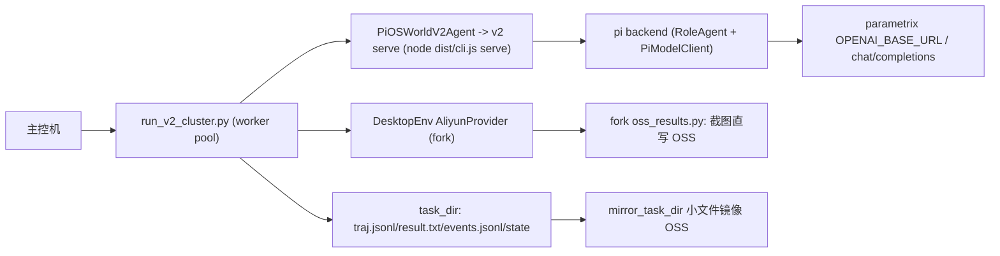

# pi-osworld-v2 集群实验计划

> 2026-08-11 决策：**先依赖同事 fork 作为 `external/OSWorld-V2` submodule 跑通集群流程**。
> fork：`moreC/OSWorld-V2` branch `dev/zhilongli`
> commit `e189bb845fcb9a1c7476a643c1729c06e4f66b24`（private repo）。
> 自包含迁移（去掉 fork 依赖）保留为 Phase 4 的退出条件。

## 目标

- 在已有集群流程（主控机 `47.120.53.174`，Aliyun ECS + OSS + parametrix/qwen）上跑
  v2 harness 实验（m3 / stateact / 后续 mea、对比矩阵），不再依赖 MiniMax Token Plan。
- v2 的差异只体现在 `--config` YAML 与 prompts；runner 不因 harness 不同而改动。
- 先用同事 fork 直接复用 Aliyun / OSS / 调度能力，跑通后 Phase 4 再把依赖收回到 v2。

## 当前依赖与能力归属

`external/OSWorld-V2` 已替换为同事 fork，官方 `xlang-ai/OSWorld-V2` 仍保留在 git
历史里可回退。fork 自带集群能力：

| 能力 | 所在位置 | 说明 |
| --- | --- | --- |
| Aliyun ECS provider | `desktop_env/providers/aliyun/` | 创建/删除/私网 IP/TTL/revert 重试 |
| OSS 截图直写 | `oss_results.py` | `save_screenshot` / `mirror_task_dir` / 历史索引 |
| v2 任务解析 | `task_loader.py` | 与官方一致，直接用 |
| agent 循环 | `lib_run_single.py` | `run_single_example` / checkpoint / multi-phase |
| 集群调度参考 | `scripts/python/run_multienv.py` | worker queue、`_discard_env`、`get_unfinished`、args.json |

v2 还需要自己补：

- `python/run_v2_cluster.py`：集群调度骨架，复用 fork 的
  `DesktopEnv` / `lib_run_single` / `task_loader`，把 agent 换成 `PiOSWorldV2Agent`。
- `src/models/client.ts`：注册 `qwen-gateway` OpenAI provider，供 parametrix qwen 使用。
- `.env` / `.env.example`：补齐 Aliyun / OSS / parametrix 字段。

## 核心决策

1. **submodule 直接替换**：`external/OSWorld-V2` 从官方换成同事 fork，所有现有命令的
   `--osworld-root external/OSWorld-V2` 不用改。本地 docker 与集群 aliyun 共用同一路径。
2. **先跑通，后自包含**：Phase 1-3 依赖 fork；Phase 4 把
   `oss_results.py` / Aliyun 稳定性修复 / 调度逻辑收进 v2，再换回官方 submodule。
3. **结果布局**：沿用 fork/官方
   `result_dir/<action_space>/<observation_type>/<model>/<domain>/<task_id>`；
   v2 的 `events.jsonl` / `state` / `runner.log` / `manifest.json` 放进 task_id 目录，
   这样 `get_unfinished` 和 score 聚合直接可用。
4. **模型协议**：qwen 走 parametrix OpenAI chat/completions。v2 注册自定义 provider
   （id 建议 `qwen-gateway`）：`baseUrl = OPENAI_BASE_URL`、
   `auth = envApiKeyAuth(..., ["OPENAI_API_KEY"])`、`api = openAICompletionsApi()`、
   模型 `qwen3.7-plus`（thinkingFormat=qwen）。YAML 里
   `models.main: qwen-gateway/qwen3.7-plus`；MiniMax anthropic 路径共存。
5. **delegate / 子 agent**：集群 worker 进程内由 v2 serve 统一管理（Pi 后端），
   不经过 fork 的 QwenInternalAgent 解析器。

## 数据流



每个 OSWorld step 的调用链：

1. worker 从 task queue 取 task，创建/复用 VM（AliyunProvider）。
2. `lib_run_single.run_single_example` 调 `PiOSWorldV2Agent.predict(instruction, obs)`。
3. v2 serve 执行一轮 harness（含角色内部工具循环 / delegate / gate），返回 actions。
4. `env.step(action)` 执行 pyautogui；截图经 fork `oss_results.py` 直写 OSS。
5. 任务结束 `env.evaluate()`，写 `result.txt` / `result.json`；`mirror_task_dir` 镜像小文件。

## 阶段计划

### Phase 0：前置依赖

- [ ] 完成 submodule 替换并 pin：`external/OSWorld-V2` -> fork @ `e189bb8`。
- [ ] 确认 parametrix 网关可用域名（runbook 中 `omni-gateway-sg.parametrix.cn` 当前
      NXDOMAIN；用 `parametrix.cn/v1` 或让网关方确认稳定域名）。
- [ ] v2 增加 `qwen-gateway` provider + 单测（模型解析、thinking disabled、base_url/key）。
- [ ] `python/run_v2_cluster.py`：复用 fork 调度能力，agent 换成 `PiOSWorldV2Agent`；
      CLI 补 `--provider-name aliyun`、`--use-public-ip`、`--enable-vnc` /
      `--enable-recording`、`--region`、`--test-all-meta-path`。
- [ ] 本机验证：用 fork + docker 跑通一次 m3/stateact smoke，确认 v2 bridge 不受
      submodule 替换影响。

验收：`npm test` 通过；`run_v2_cluster.py --help` 包含全部集群参数；本地 docker smoke
跑通；qwen provider 在本地以 parametrix key 发一次最小请求成功。

### Phase 1：集群单任务冒烟

- [ ] 部署 v2 `dist/` + `python/` + 配置树到主控机（`scripts/deploy-cluster.sh`），
      主控机使用同一 fork commit。
- [ ] `run_v2_cluster.py --config presets/stateact.yaml --provider-name aliyun
      --osworld-root <主控机 OSWorld-V2> --num-envs 1` 跑 task 001 / 004。
- [ ] 同时跑一个 m3 preset 作为对照；score 与本地 docker 同配置量级一致。
- [ ] 产物检查：`result.txt` / `result.json` / `traj.jsonl` / `events.jsonl` / `state` /
      `runner.log` / `args.json`；OSS 上有截图与镜像文件。

### Phase 2：并行 + 断点 + OSS

- [ ] worker 循环 + VM 复用 + `_discard_env` 失败废弃。
- [ ] `get_unfinished` 跳过已有 `result.txt`（断点续跑）。
- [ ] `mirror_task_dir` 每任务结束镜像；`args.json` 存档；worker 死亡自动重启。
- [ ] `--num-envs 4` 跑 `meta_001_004.json` 冒烟。

### Phase 3：矩阵实验

- [ ] 复用 v2 `matrix` / `compare`：2 配置 x 2 任务集，每个组合独立 run_id。
- [ ] 聚合 score / success rate + events 指标（delegate 次数、工具调用、gate verdict）。
- [ ] 输出 markdown 对比报告；与 v1 / 官方 baseline 做同配置对比。

### Phase 4：自包含迁移（退出 fork 依赖）

- [ ] 把 fork 的集群增量收进 v2：`python/cluster/oss_results.py`、
      `patches/osworld-cluster.patch`（lib_run_single OSS + Aliyun revert 重试）、
      `python/run_v2_cluster.py` 保留为 v2 自有代码。
- [ ] `external/OSWorld-V2` 换回官方 `xlang-ai/OSWorld-V2` 同 commit，setup.sh 应用
      v2 补丁。
- [ ] 用同一 YAML 在“fork 阶段”和“自包含阶段”各跑一遍 task 004，score 对拍。

## 结果目录约定

```text
<result_dir>/
└── pyautogui/screenshot/<model>/<domain>/<task_id>/
    ├── result.txt / result.json
    ├── traj.jsonl
    ├── events.jsonl            # v2 结构化事件
    ├── state/                  # v2 TaskStateStore
    ├── runner.log
    ├── args.json               # 集群 runner 参数存档
    ├── step_*.png              # OSS_ENABLED=1 时直写 OSS，本地可能只有索引
    └── recording.mp4
```

`get_unfinished` 以 `result.txt` 为准，因此同一结果目录重跑不会重复执行已完成任务。

## 部署与环境变量

主控机 `.env`（v2 部署时复用，不新造）：

```bash
ALIYUN_ACCESS_KEY_ID / ALIYUN_ACCESS_KEY_SECRET
ALIYUN_REGION / ALIYUN_IMAGE_ID / ALIYUN_INSTANCE_TYPE
ALIYUN_VSWITCH_ID / ALIYUN_SECURITY_GROUP_ID
DEFAULT_TTL_MINUTES=180 / ENABLE_TTL=true
OSS_ENABLED=1 / OSS_ACCESS_KEY_ID / OSS_ACCESS_KEY_SECRET
OSS_BUCKET / OSS_ENDPOINT / OSS_PREFIX
ANTHROPIC_BASE_URL=https://api.minimaxi.com/anthropic
ANTHROPIC_API_KEY / ANTHROPIC_MODEL=m3
OPENAI_BASE_URL=<parametrix>/v1
OPENAI_API_KEY
```

主控机目录建议：

```text
/home/zhilongli/pi-osworld-v2        # v2 仓库（dist + python + 配置树）
/home/zhilongli/OSWorld-V2          # 同一 fork commit，或直接用 v2 的 external/OSWorld-V2
```

## 风险与决策点

1. **私有 submodule 可复现性**：fork 是私有仓库，外部 clone v2 需要 token 才能拉
   submodule；这是临时取舍，Phase 4 自包含后解除。
2. **网关稳定性/域名**：`omni-gateway-sg.parametrix.cn` 当前 NXDOMAIN；先用
   `parametrix.cn/v1`，后续让网关方提供稳定域名，或把 base URL 做成 YAML/env 可覆盖。
3. **fork 版本漂移**：submodule 已 pin 到 `e189bb8`；升级 fork 前先跑 Phase 1 对拍。
4. **并发与配额**：28 env 起 ECS 可能撞配额；28 个 agent 共用同一 api key 有 429 风险。
   v2 的 `llm_retry` spec 要在集群运行中开启。
5. **结果布局**：默认沿用 fork 布局，避免 `get_unfinished` 和 score 聚合失效；
   如果要 v2 特有布局，需要同步改 `get_unfinished` 与聚合脚本。
6. **协议差异**：fork QwenInternalAgent 用 XML tool-call + history folding，v2 用 Pi
   的 native tool call + 上下文管理器；集群对比实验必须用同一 harness 语义（v2），
   与官方 baseline 对比时才需要协议对齐。
7. **SSH/密钥**：`.env`、Aliyun/OSS key 与运行手册禁止 push 到公开仓库。
